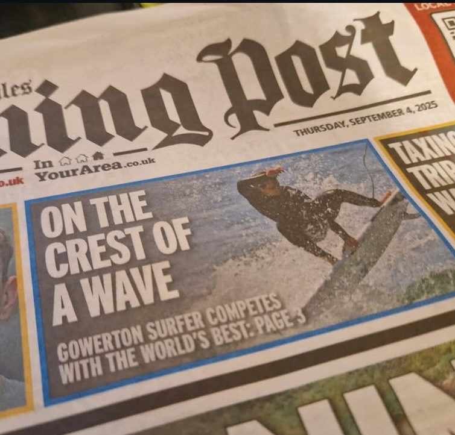
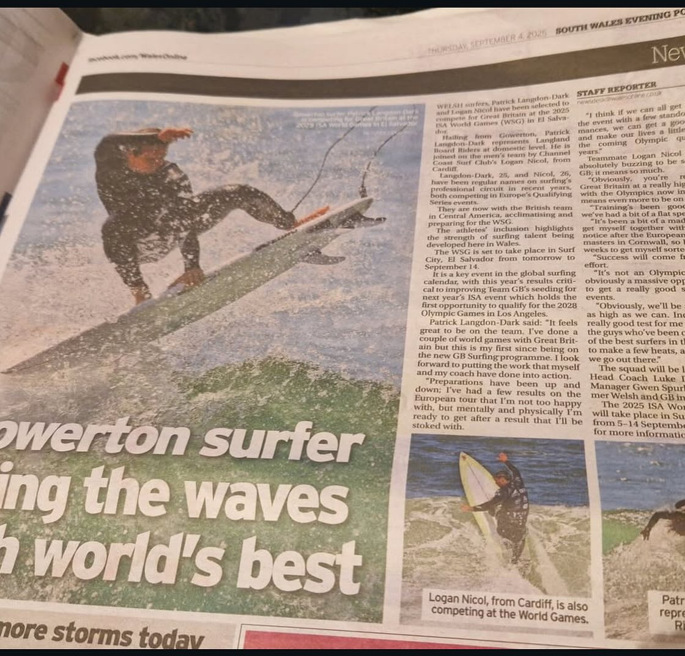
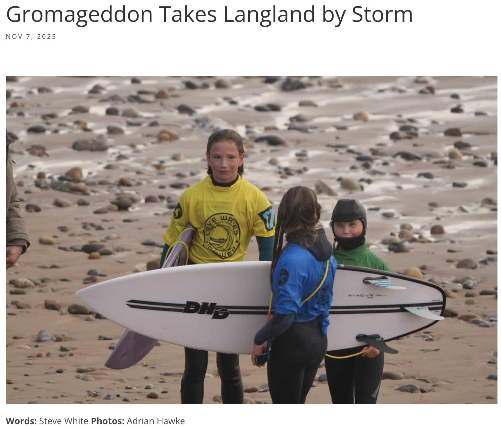
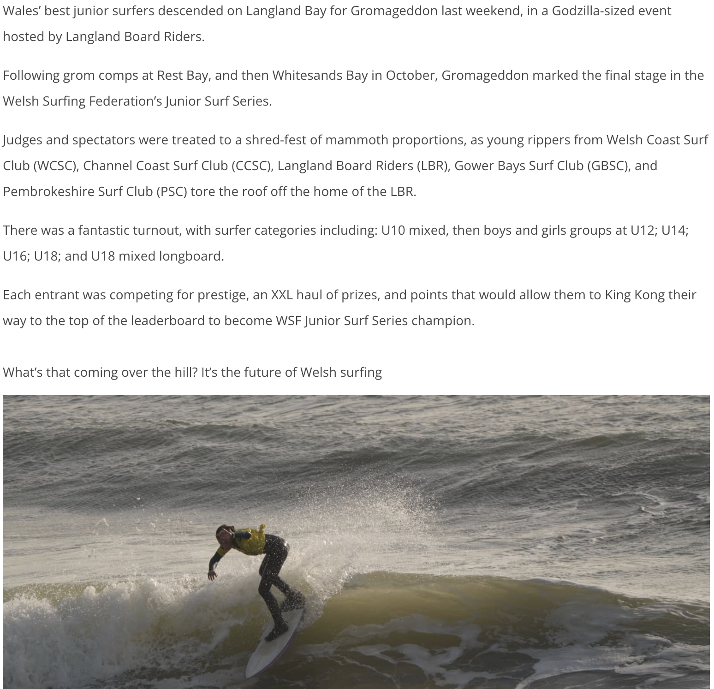
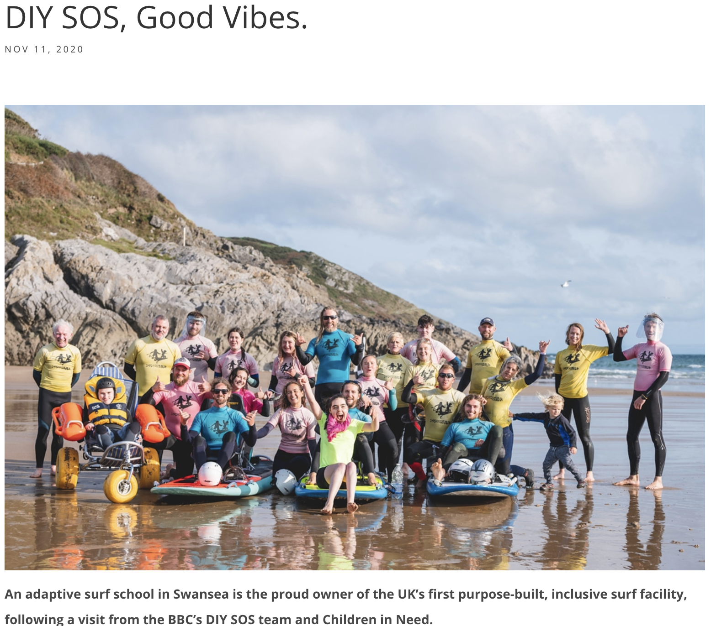
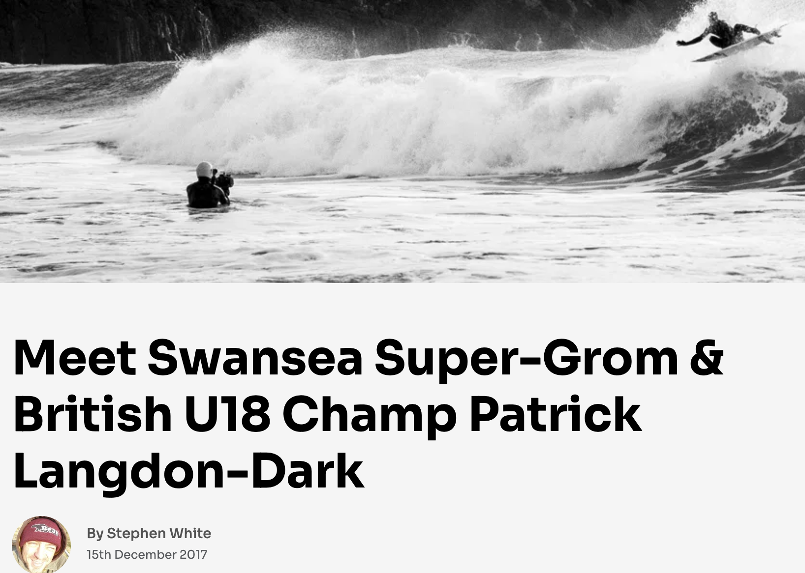
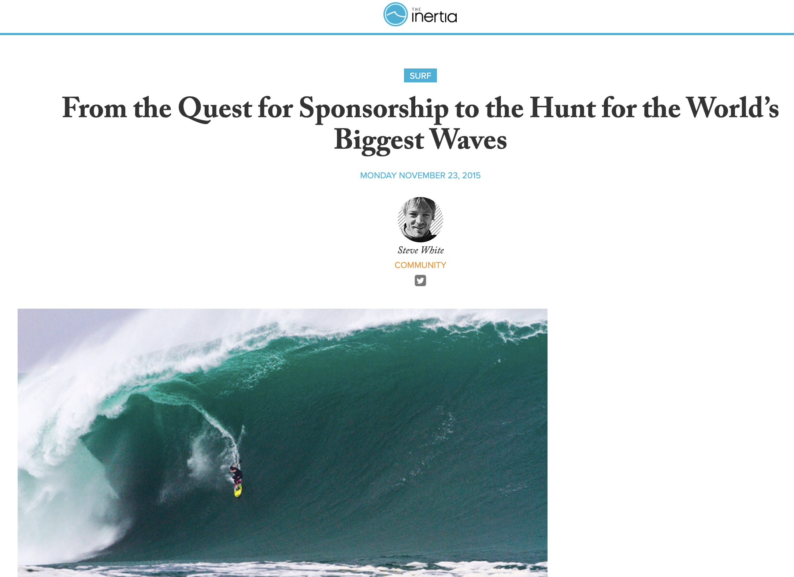

# Surf Journalism
A curated portfolio of surf journalism by Steve White covering Welsh competitions, athlete profiles and the wider UK surf scene.

Publications include: 
South Wales Evening Post; Carve Magazine; Wavelength Magazine; The Inertia; Welsh Surfing Federation; The Inertia; Welsh Sports Association.

Topics include: competition coverage; athlete profiles; athlete interviews; Welsh surf scene; event reporting

- ## Featured Work

• **Llywelyn “Sponge” Williams – Four-Time World Para Surf Champion**  
Carve Magazine feature on Wales’ four-time ISA World Para Surfing Champion.  
https://www.carvemag.com/2025/11/llywelyn-williams-four-time-world-para-surf-champ/

• **So Sick! The Return of the Toxic Trophy**  
Feature preview exploring the environmental roots of Langland’s iconic protest contest.  
https://www.carvemag.com/2024/10/so-sick-the-return-of-the-toxic-trophy/

• **Get Ready for The Welsh 2025**  
Preview of the PuraVida MiPost Welsh National Surfing Championships.  
https://www.carvemag.com/2025/05/get-ready-for-the-welsh-2025/

• **Welsh Surfers Selected to Represent Great Britain at the 2025 ISA World Surfing Games**  
Published in South Wales Evening Post. News feature announcing the selection of Patrick Langdon-Dark and Logan Nicol to compete for Team GB at the ISA World Surfing Games in El Salvador.
https://www.wsf.wales/news/welsh-surfers-selected-to-represent-great-britain-at-2025-isa-world-surfing-games

## Selected Articles

### Llywelyn Williams Four-Time World Para Surf Champ

Publication: Carve Magazine  
Date: November 2025  
Role: Journalist / writer  

News feature covering Welsh para-surfing champion Llywelyn “Sponge” Williams after securing his fourth ISA World Para Surfing Championship title in Oceanside, California.

Read the full article on the [WSF website](https://www.carvemag.com/2025/11/llywelyn-williams-four-time-world-para-surf-champ/).  

### Welsh Surfers Selected to Represent Great Britain at the 2025 ISA World Surfing Games

Publication: Welsh Surfing Federation and *South Wales Evening Post* (print)
Date: September 2025  
Role: Journalist / writer  

Published in *South Wales Evening Post*, this news feature announces the selection of Welsh surfers Patrick Langdon-Dark and Logan Nicol to represent Great Britain at the 2025 ISA World Surfing Games in Surf City, El Salvador — a key event on the international surfing calendar and an important step toward Olympic qualification for the LA 2028 Games.

Read the full article on the [WSF website](https://www.wsf.wales/news/welsh-surfers-selected-to-represent-great-britain-at-2025-isa-world-surfing-games).

### Welsh Surfing Federation – 2025 in Review

Publication: Welsh Sports Association (WSA)  
Date: February 2026  
Role: Journalist / writer  

A year-in-review feature highlighting the achievements of Welsh surfers and the Welsh Surfing Federation across domestic and international competition during the 2025 season, including major performances from athletes such as Llywelyn “Sponge” Williams and Patrick Langdon-Dark. 

Read the full article:  
https://wsa.wales/welsh-surfing-federation-2025-in-review/

### So Sick! The Return of the Toxic Trophy

Publication: Carve Magazine  
Date: October 2024  
Role: Journalist / writer  

Feature preview covering the return of the legendary Toxic Trophy at Langland Bay, organised by Langland Board Riders and Surfers Against Sewage. The article explores the history of the contest, its environmental roots, and the ongoing issue of water quality in Welsh coastal waters, featuring comment from Surfers Against Sewage CEO, Giles Bristow, environmental campaigner Chris Hines MBE, and Welsh Water.

Read the full article:  
https://www.carvemag.com/2024/10/so-sick-the-return-of-the-toxic-trophy/

### Get Ready for The Welsh 2025

Publication: Carve Magazine  
Date: May 2025  
Role: Journalist / writer  

Preview feature ahead of the PuraVida MiPost Welsh National Surfing Championships at Freshwater West, highlighting the history and prestige of “The Welsh” and featuring interviews with reigning champions Logan Nicol and Josie Hawke discussing their preparation and ambitions for the 2025 contest.

Read the full article:  
https://www.carvemag.com/2025/05/get-ready-for-the-welsh-2025/

### Team England Dominate to Take the GB Cup 2023

Publication: Welsh Surfing Federation  
Date: October 2023  
Role: Journalist / writer  

Competition report from the GB Cup held at Fistral Beach, Newquay, where Team England secured the overall team title ahead of Wales, Scotland and the Channel Islands. The event saw standout performances from England’s Stanley Norman and Lauren Sandland, while Wales’ Patrick Langdon-Dark finished runner-up in the men’s final.

Read the full article:  
https://www.wsf.wales/news/team-england-dominate-to-take-the-gb-cup-2023-

### Gromageddon Takes Langland by Storm

Publication: Carve Magazine  
Date: November 2025  
Role: Journalist / writer  

Competition report from Langland Bay where Wales’ top junior surfers gathered for the Gromageddon event hosted by Langland Board Riders. The contest marked the final stop of the Welsh Surfing Federation Junior Surf Series, with young surfers competing across multiple age divisions in lively 2–4ft surf while spectators lined the promenade to watch the next generation of Welsh talent in action. :contentReference[oaicite:0]{index=0}

Read the full article:  
https://www.carvemag.com/2025/11/gromageddon-takes-langland-by-storm/

### DIY SOS, Good Vibes

Publication: Carve Magazine  
Date: November 2020  
Role: Journalist / writer  

News feature covering the opening of Surfability UK’s purpose-built adaptive surf facility at Caswell Bay following a BBC DIY SOS Big Build project supported by Children in Need. The article highlights the work of Surfability founder Ben Clifford and the organisation’s mission to help surfers with physical and cognitive impairments experience the freedom of riding waves. Exclusive comment from DIY SOS presenter, Nick Knowles.

Read the full article:  
https://www.carvemag.com/2020/11/diy-sos-good-vibes/

### Meet Swansea Super-Grom & British U18 Champ Patrick Langdon-Dark

Publication: Wavelength Magazine  
Date: December 2017  
Role: Journalist / writer  

Interview with Welsh surfer Patrick Langdon-Dark following his rise through the UK junior ranks, including his U18 UK Pro Surf Tour title and success on the Nerf Clash of the Groms series. The conversation explores his training regime, early surfing influences on Gower, competitive ambitions and the challenge of balancing education with a developing international surf career.

Read the full article:  
https://wavelengthmag.com/interview-patrick-langdon-dark/

### From the Quest for Sponsorship to the Hunt for the World’s Biggest Waves

Publication: The Inertia  
Date: November 2015  
Role: Journalist / writer  

Interview feature with British big-wave surfer Andrew Cotton following the release of his film *Behind The Lines*. The conversation explores the realities of chasing giant waves at Nazaré and Mullaghmore, the challenge of securing sponsorship and funding for big-wave projects, and the physical and mental demands of pushing the limits of modern big-wave surfing.

Read the full article:  
https://www.theinertia.com/surf/from-the-quest-for-sponsorship-to-the-hunt-for-the-worlds-biggest-waves/

