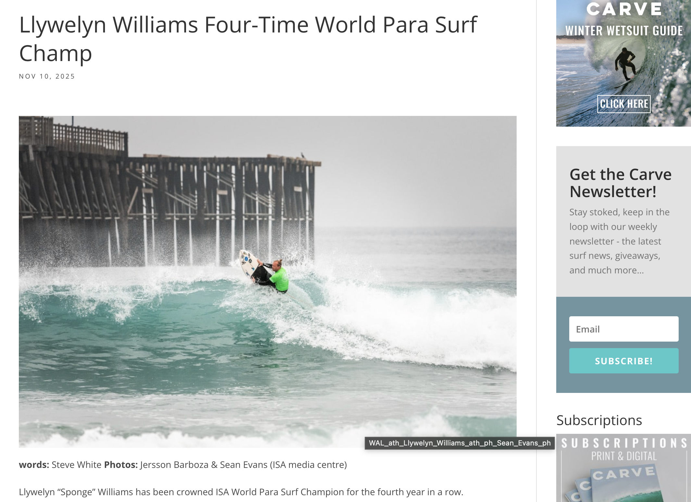
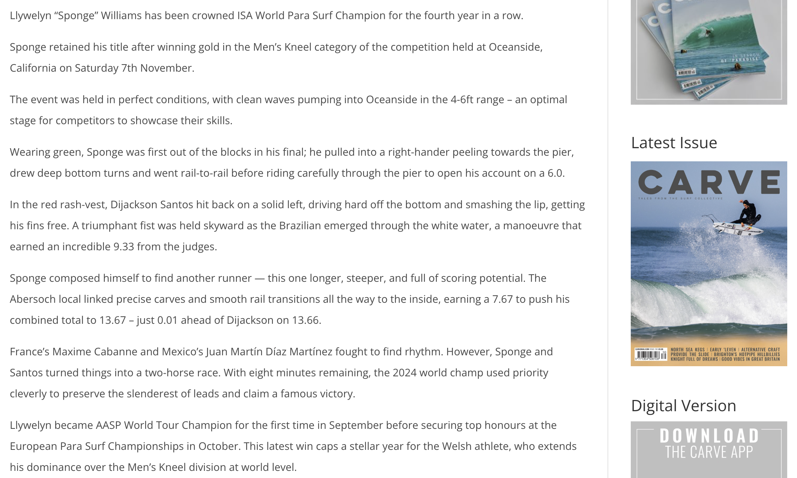
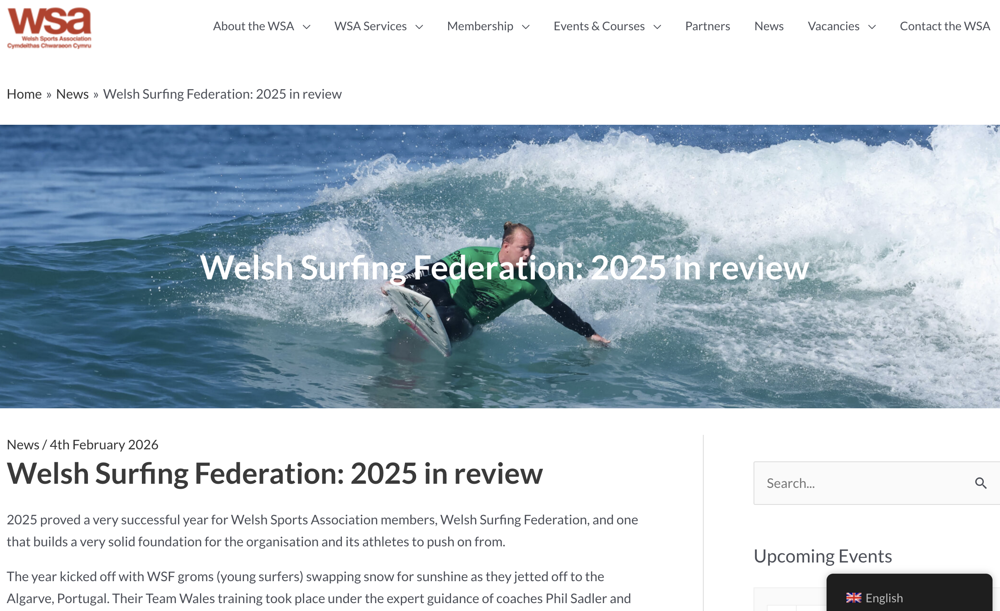
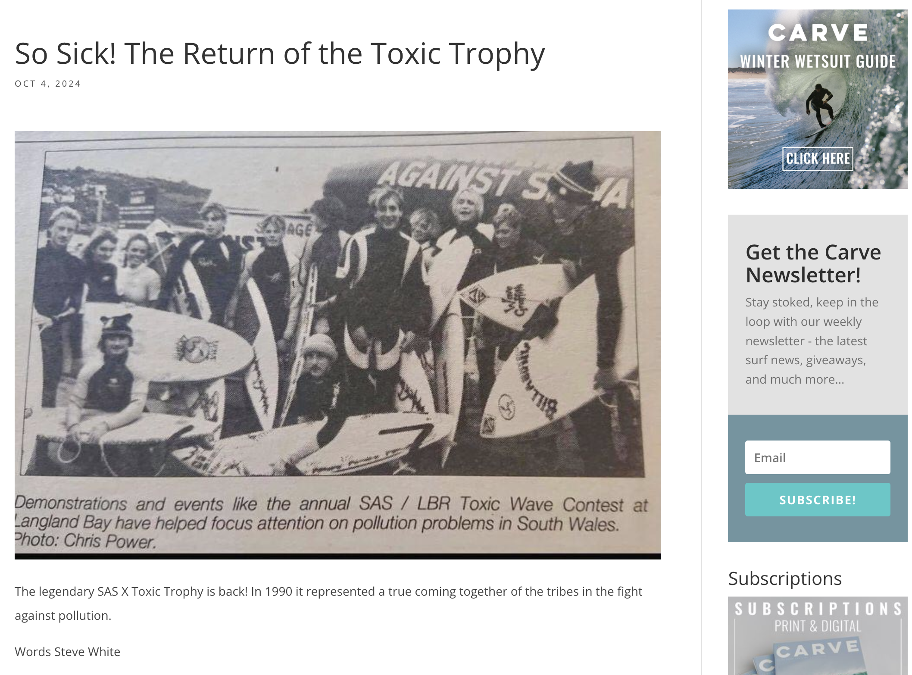
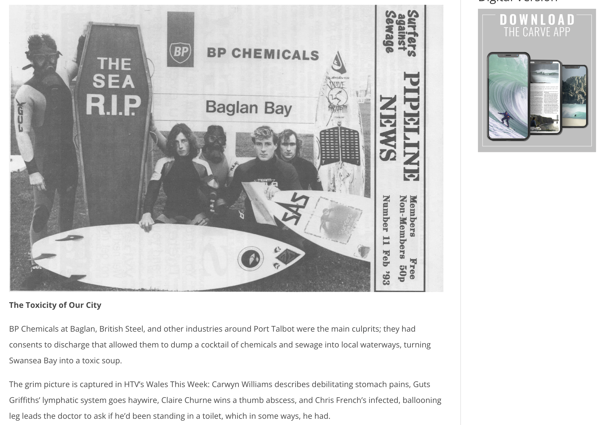
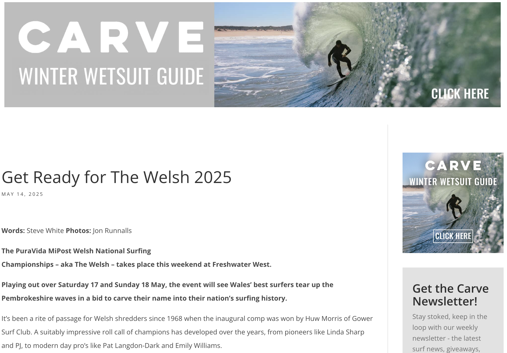
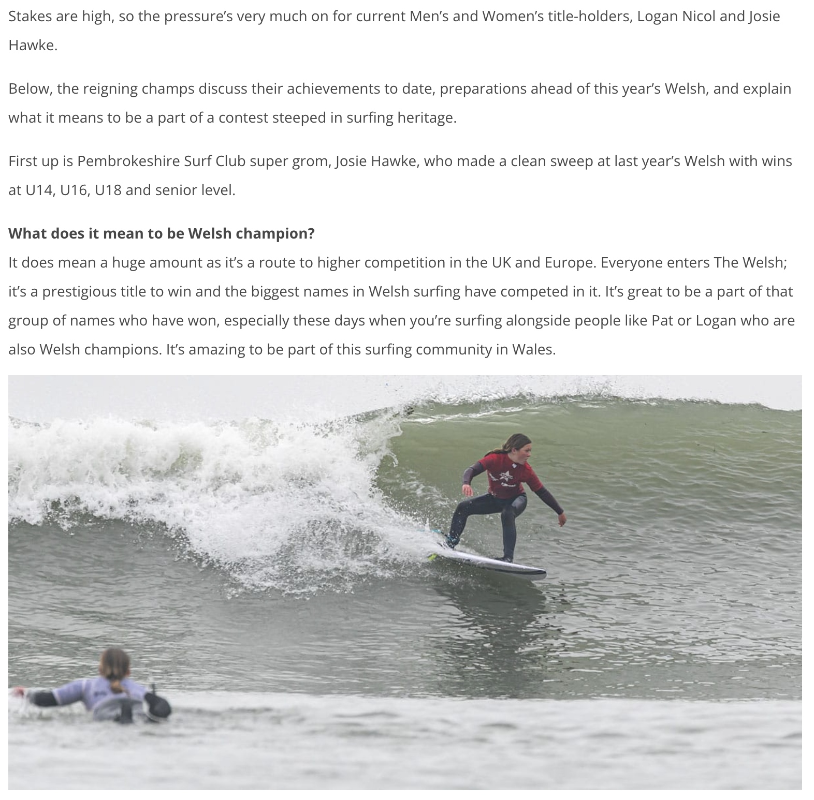
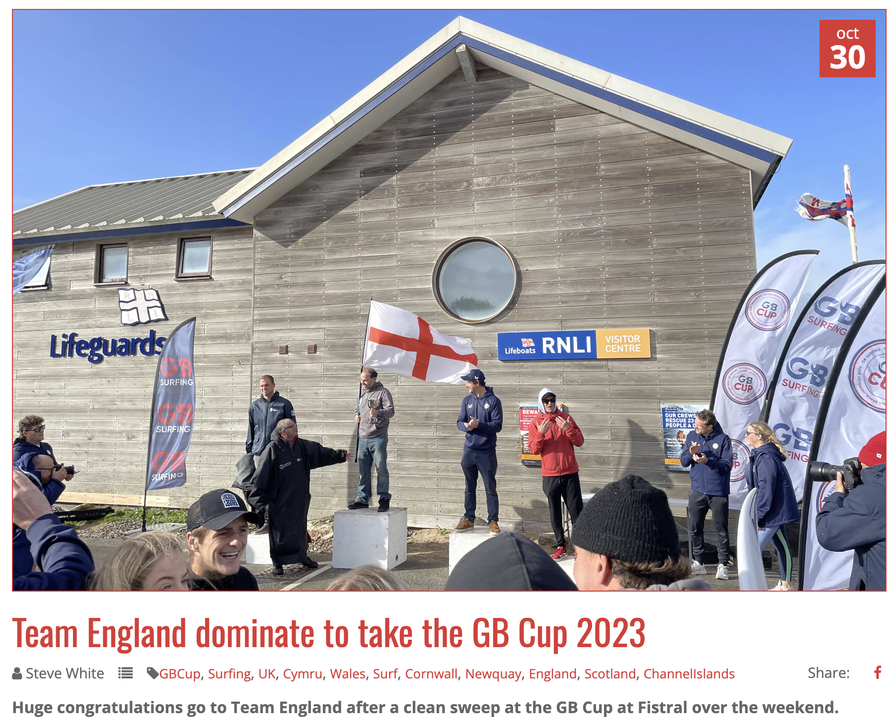

# Surf Journalism
A portfolio of my work as a surf journalist.
This repository contains a selection of surf journalism written by Steve White,
covering surf competitions and events at Wales and UK level, athlete profiles and surf culture.

Publications include:

- Welsh Surfing Federation
- Carve Magazine
- Wavelength Magazine
- The Inertia
- Welsh Sports Association

Topics include:

- competition coverage
- athlete profiles
- athlete interviews
- Welsh surf scene
- event reporting

- ## Selected Articles

### Llywelyn Williams Four-Time World Para Surf Champ

Publication: Carve Magazine  
Date: November 2025  
Role: Journalist / writer  

News feature covering Welsh para-surfing champion Llywelyn “Sponge” Williams after securing his fourth ISA World Para Surfing Championship title in Oceanside, California.

Read the full article:  
https://www.carvemag.com/2025/11/llywelyn-williams-four-time-world-para-surf-champ/

### Welsh Surfing Federation – 2025 in Review

Publication: Welsh Sports Association (WSA)  
Date: February 2026  
Role: Journalist / writer  

A year-in-review feature highlighting the achievements of Welsh surfers and the Welsh Surfing Federation across domestic and international competition during the 2025 season, including major performances from athletes such as Llywelyn “Sponge” Williams and Patrick Langdon-Dark. 

Read the full article:  
https://wsa.wales/welsh-surfing-federation-2025-in-review/

### So Sick! The Return of the Toxic Trophy

Publication: Carve Magazine  
Date: October 2024  
Role: Journalist / writer  

Feature preview covering the return of the legendary Toxic Trophy at Langland Bay, organised by Langland Board Riders and Surfers Against Sewage. The article explores the history of the contest, its environmental roots, and the ongoing issue of water quality in Welsh coastal waters, featuring comment from Surfers Against Sewage CEO, Giles Bristow, environmental campaigner Chris Hines MBE, and Welsh Water.

Read the full article:  
https://www.carvemag.com/2024/10/so-sick-the-return-of-the-toxic-trophy/

### Get Ready for The Welsh 2025

Publication: Carve Magazine  
Date: May 2025  
Role: Journalist / writer  

Preview feature ahead of the PuraVida MiPost Welsh National Surfing Championships at Freshwater West, highlighting the history and prestige of “The Welsh” and featuring interviews with reigning champions Logan Nicol and Josie Hawke discussing their preparation and ambitions for the 2025 contest.

Read the full article:  
https://www.carvemag.com/2025/05/get-ready-for-the-welsh-2025/

### Team England Dominate to Take the GB Cup 2023

Publication: Welsh Surfing Federation  
Date: October 2023  
Role: Journalist / writer  

Competition report from the GB Cup held at Fistral Beach, Newquay, where Team England secured the overall team title ahead of Wales, Scotland and the Channel Islands. The event saw standout performances from England’s Stanley Norman and Lauren Sandland, while Wales’ Patrick Langdon-Dark finished runner-up in the men’s final.

Read the full article:  
https://www.wsf.wales/news/team-england-dominate-to-take-the-gb-cup-2023-

