# Surf Journalism
A curated portfolio of surf journalism by Steve White covering Welsh competitions, athlete profiles and the wider UK surf scene.

Publications include: 
South Wales Evening Post; Carve Magazine; Wavelength Magazine; The Inertia; Welsh Surfing Federation; Welsh Sports Association.

Topics include: competition coverage; athlete profiles; athlete interviews; Welsh surf scene; event reporting.

## Featured Work
• **Surfing Trio Hoping to Ride Wave of Success in Africa**
Regional press coverage featuring Welsh surfers competing on the World Surf League Qualifying Series in Morocco.
Read on [Pressreader](https://www.pressreader.com/uk/south-wales-evening-post/20260324/page/35)

• **Llywelyn “Sponge” Williams – Four-Time World Para Surf Champion**  
Carve Magazine feature on Wales’ four-time ISA World Para Surfing Champion.  
https://www.carvemag.com/2025/11/llywelyn-williams-four-time-world-para-surf-champ/

• **So Sick! The Return of the Toxic Trophy**  
Feature preview exploring the environmental roots of Langland’s iconic protest contest.  
https://www.carvemag.com/2024/10/so-sick-the-return-of-the-toxic-trophy/

• **Welsh Surfers Selected to Represent Great Britain at the 2025 ISA World Surfing Games**  
Published in *South Wales Evening Post*. News feature announcing the selection of Patrick Langdon-Dark and Logan Nicol to compete for Team GB at the ISA World Surfing Games in El Salvador.
https://www.wsf.wales/news/welsh-surfers-selected-to-represent-great-britain-at-2025-isa-world-surfing-games

## Selected Articles

### Surfing Trio Hoping to Ride Wave of Success in Africa
**22 March 2026:** Regional press coverage featuring Welsh surfers competing on the World Surf League Qualifying Series in Morocco.

Print publication: *South Wales Evening Post*

Read on [WSF website](https://www.wsf.wales/news/welsh-surfers-selected-to-represent-great-britain-at-2025-isa-world-surfing-games); [Pressreader](https://www.pressreader.com/uk/south-wales-evening-post/20260324/page/35)

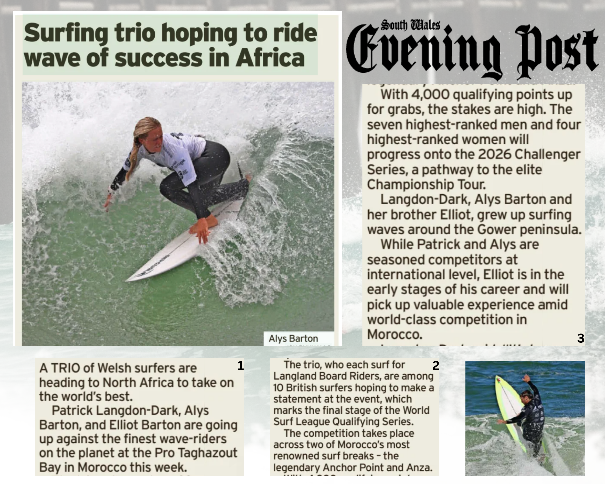

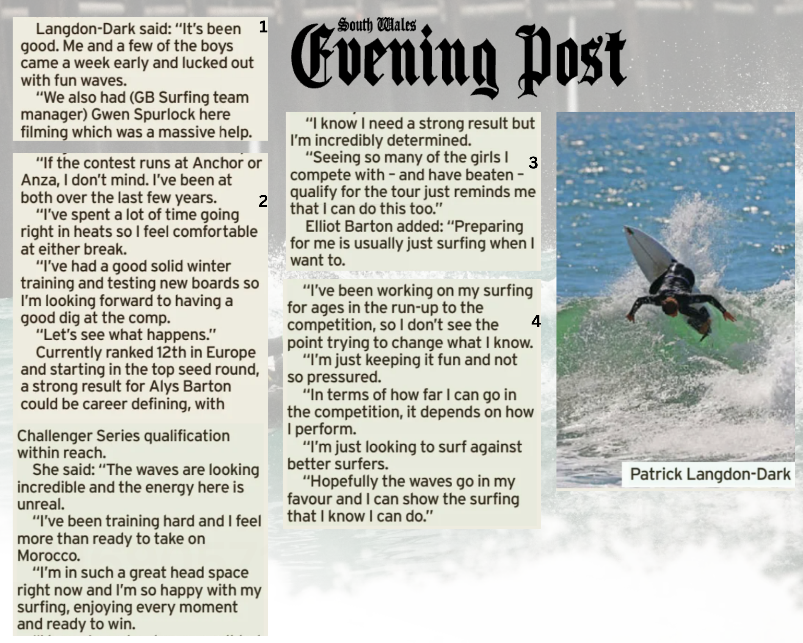

### Llywelyn Williams Four-Time World Para Surf Champ
**25 Sept 2025:** News feature covering Welsh para-surfing champion Llywelyn “Sponge” Williams after securing his fourth ISA World Para Surfing Championship title in Oceanside, California.

Read on [Carve Magazine](https://www.carvemag.com/2025/09/llywelyn-williams-aasp-world-tour-champion/); [WSF website](https://www.carvemag.com/2025/11/llywelyn-williams-four-time-world-para-surf-champ/)

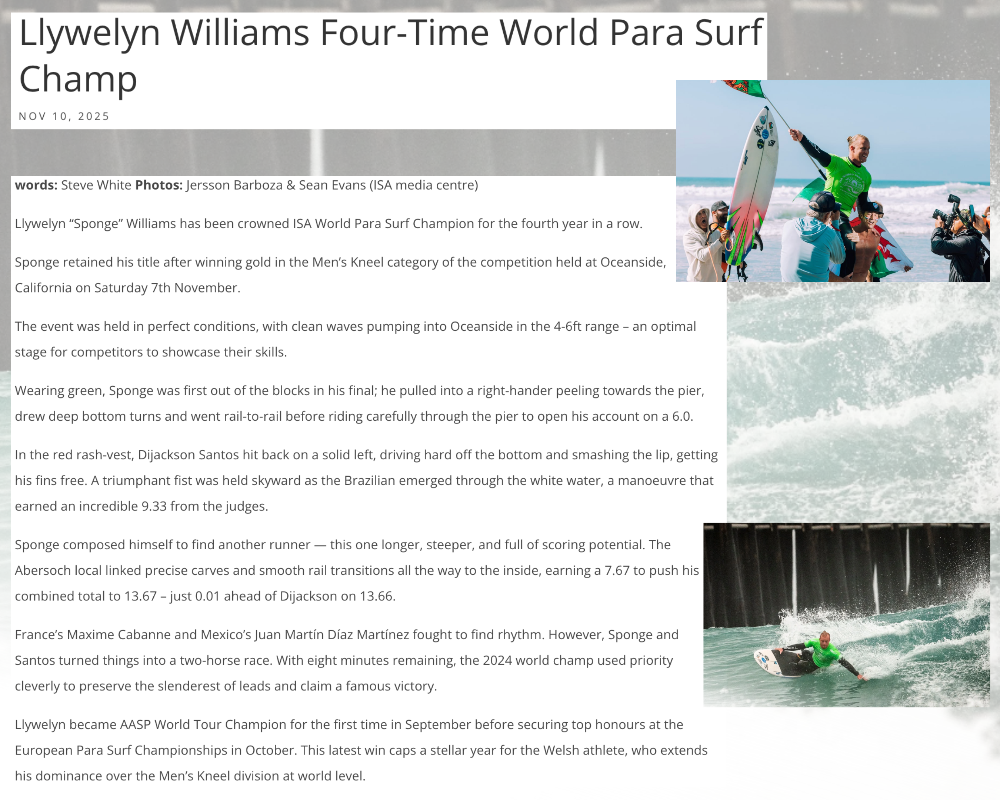

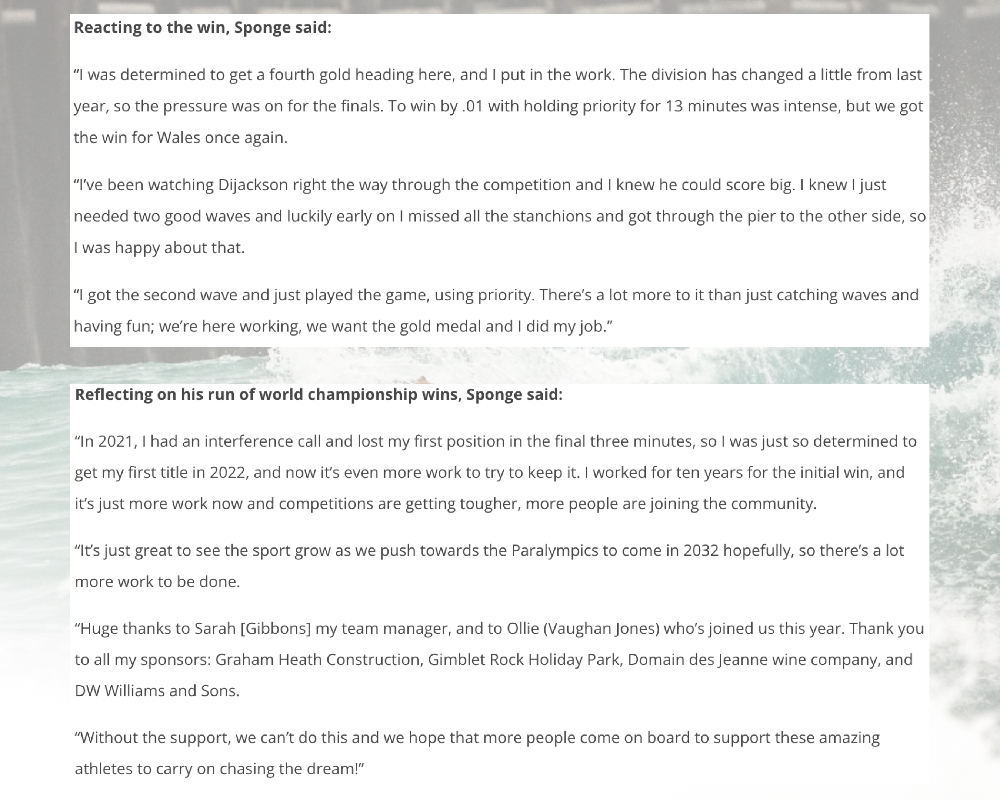

### Welsh Surfers Selected to Represent Great Britain at the 2025 ISA World Surfing Games
**4 September 2025:** News feature announcing the selection of Welsh surfers Patrick Langdon-Dark and Logan Nicol to represent Great Britain at the 2025 ISA World Surfing Games in Surf City, El Salvador — a key event on the international surfing calendar and an important step toward Olympic qualification for the LA 2028 Games.

Read on [WSF website](https://www.wsf.wales/news/welsh-surfers-selected-to-represent-great-britain-at-2025-isa-world-surfing-games); [Pressreader](https://www.pressreader.com/uk/south-wales-evening-post/20250904/page/3)

Print publication: *South Wales Evening Post*

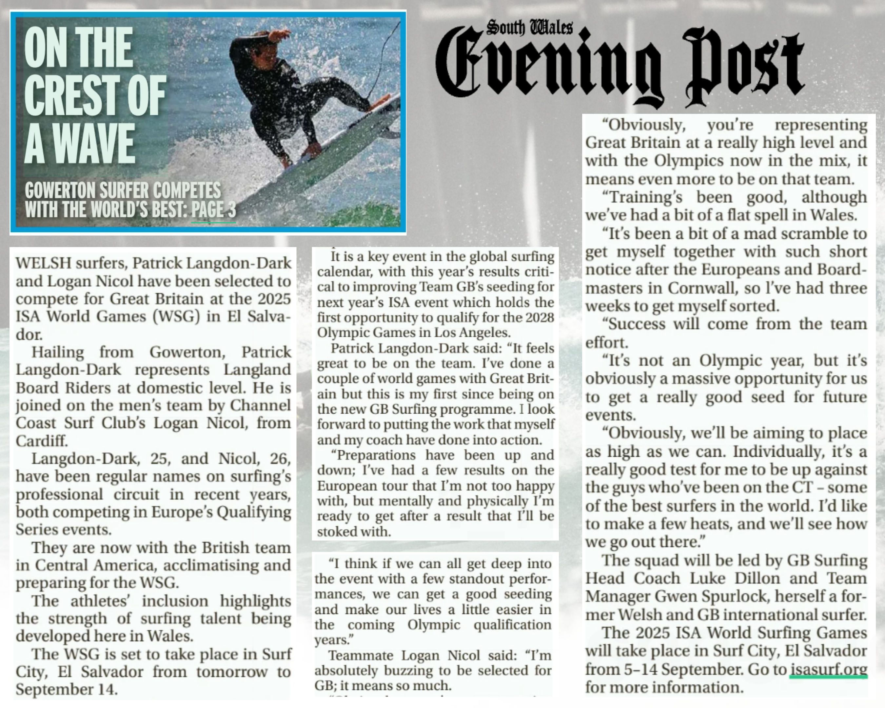

### Welsh Surfing Federation – 2025 in Review
**4 Feb 2026:** A snapshot of my year-in-review feature highlighting the achievements of Welsh surfers and the Welsh Surfing Federation across domestic and international competition during the 2025 season, including major performances from athletes such as Llywelyn “Sponge” Williams and Patrick Langdon-Dark.

Read in full on [Welsh Sports Association](https://wsa.wales/welsh-surfing-federation-2025-in-review/); 
[WSF Website](https://www.wsf.wales/news/grom-presentation-night-caps-a-great-2025-for-welsh-surfing)

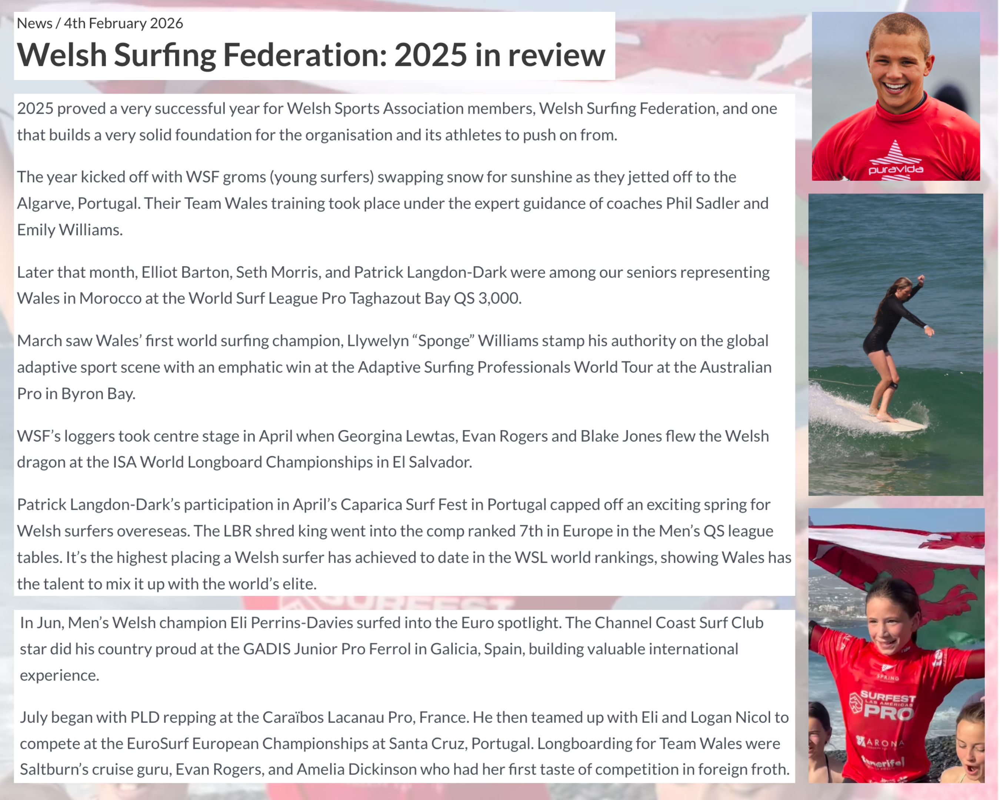

### So Sick! The Return of the Toxic Trophy
**4 October 2024:** A feature preview covering the return of the legendary Toxic Trophy at Langland Bay, organised by Langland Board Riders and Surfers Against Sewage. The article explores the history of the contest, its environmental roots, and the ongoing issue of water quality in Welsh coastal waters, featuring comment from Surfers Against Sewage CEO, Giles Bristow, environmental campaigner Chris Hines MBE, and Welsh Water.

Read on: [Carve Magazine](https://www.carvemag.com/2024/10/so-sick-the-return-of-the-toxic-trophy/)

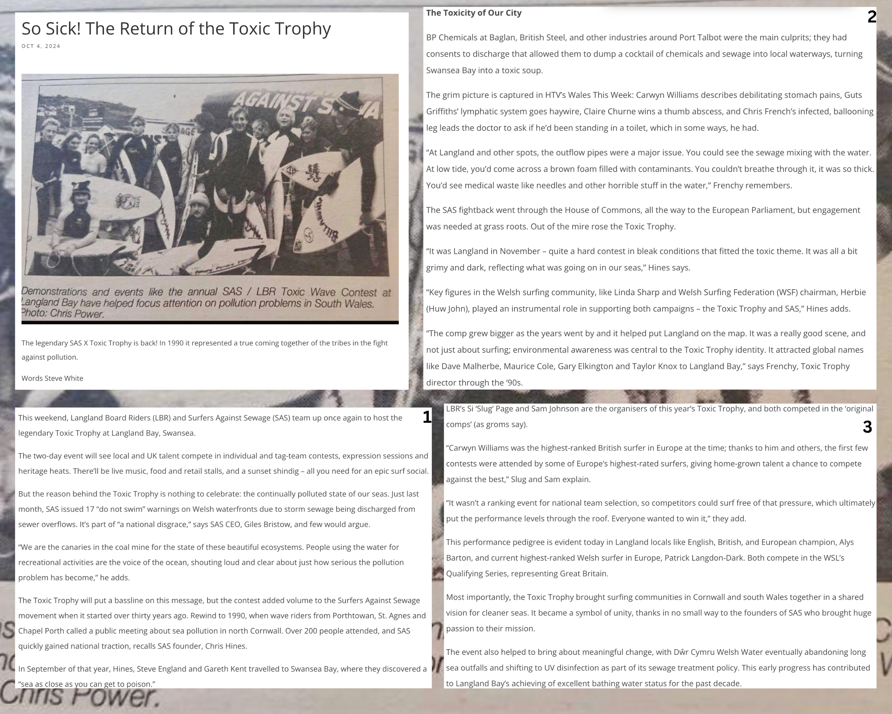

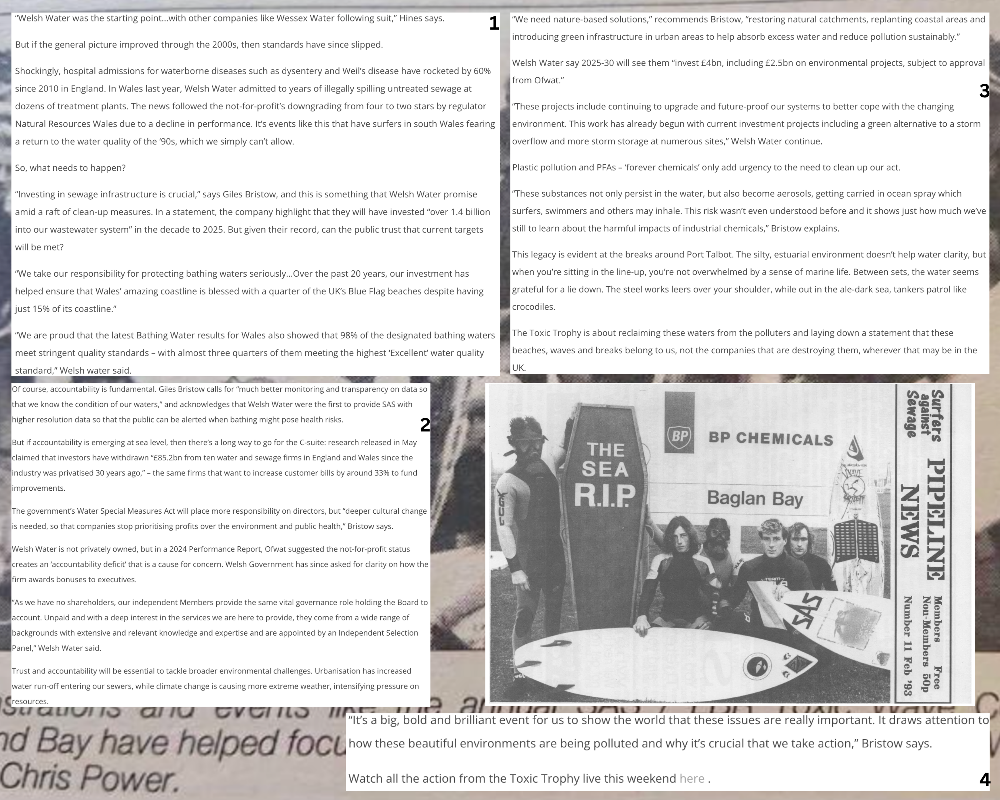

### Get Ready for The Welsh 2025
**14 May 2025:** A preview of the PuraVida MiPost Welsh National Surfing Championships at Freshwater West, highlighting the history and prestige of “The Welsh”. Includes interviews with 2024 champions Logan Nicol and Josie Hawke who discuss their preparation and ambitions for the 2025 contest.

Read on [Carve Magazine](https://www.carvemag.com/2025/05/get-ready-for-the-welsh-2025/)

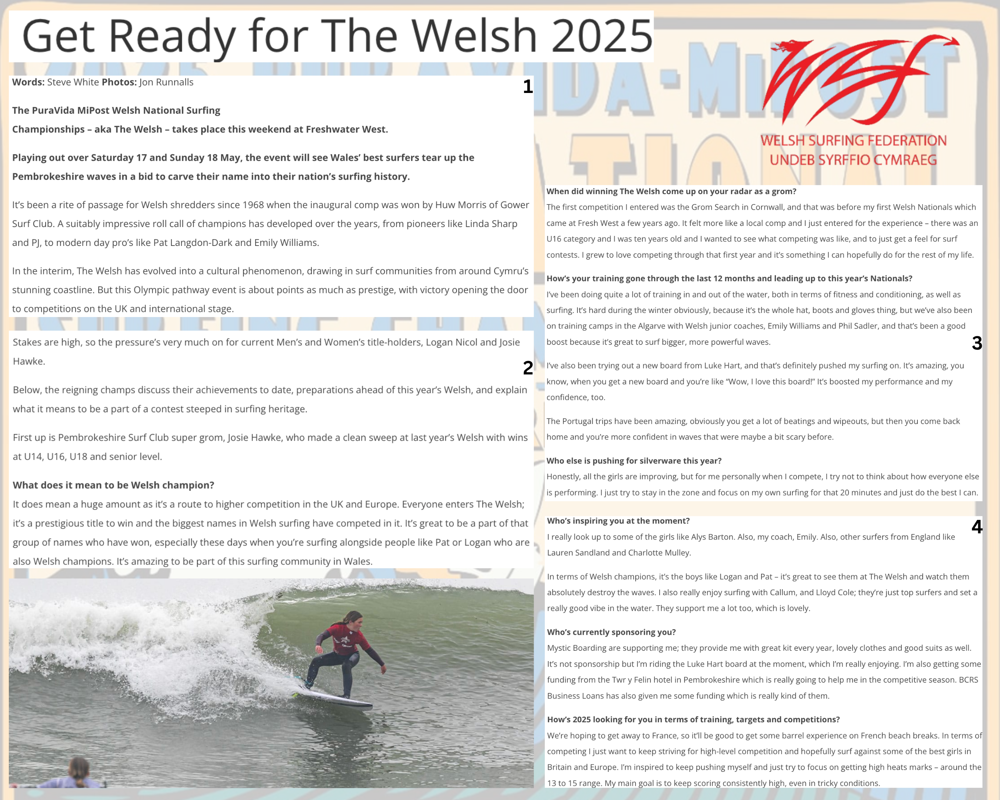

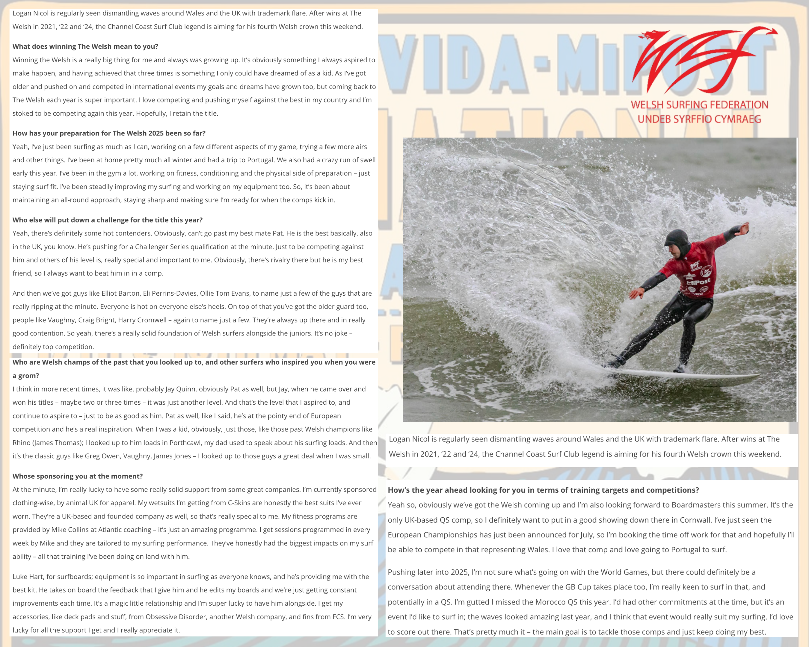

### Team England Dominate to Take the GB Cup 2023
**30 Oct 2023:** Competition report from the GB Cup held at Fistral Beach, Newquay, where Team England secured the overall team title ahead of Wales, Scotland and the Channel Islands. The event saw standout performances from England’s Stanley Norman and Lauren Sandland, while Wales’ Patrick Langdon-Dark finished runner-up in the men’s final.

Read on [Welsh Surfing Federation](https://www.wsf.wales/news/team-england-dominate-to-take-the-gb-cup-2023-)  

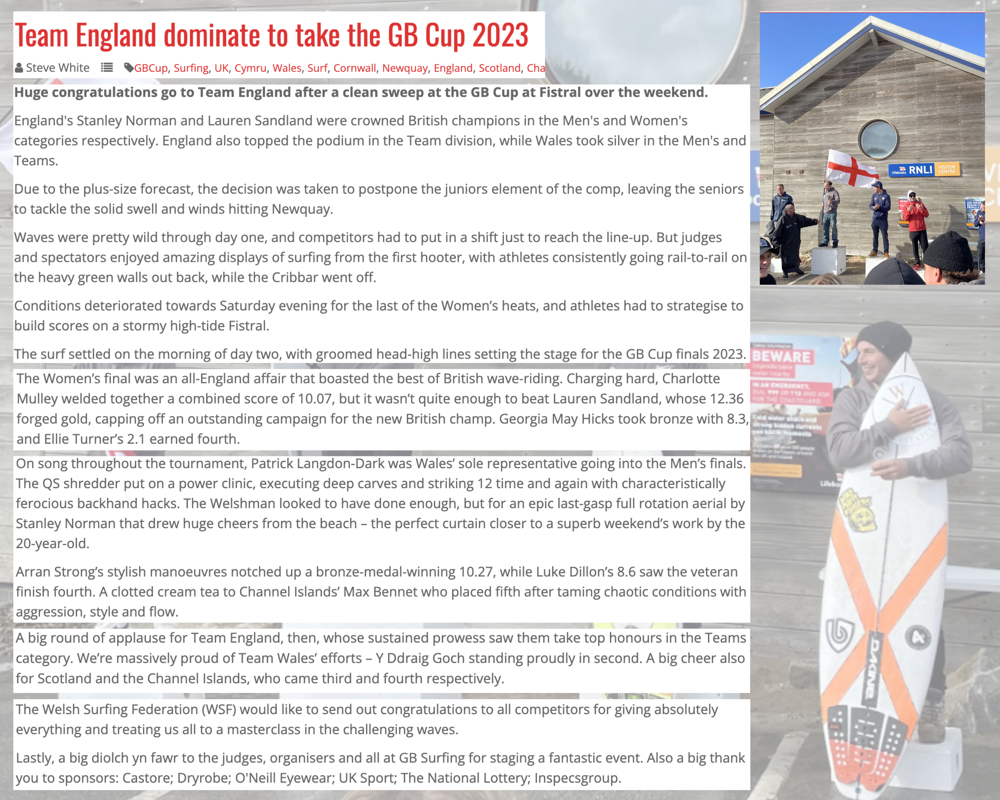

### Gromageddon Takes Langland by Storm
**7 Nov 2025:** Competition report from Langland Bay where Wales’ top junior surfers gathered for the Gromageddon event hosted by Langland Board Riders. The contest marked the final stop of the Welsh Surfing Federation Junior Surf Series, with young surfers competing across multiple age divisions in lively 2–4ft surf while spectators lined the promenade to watch the next generation of Welsh talent in action.

Read on [Carve Magazine](https://www.carvemag.com/2025/11/gromageddon-takes-langland-by-storm/)

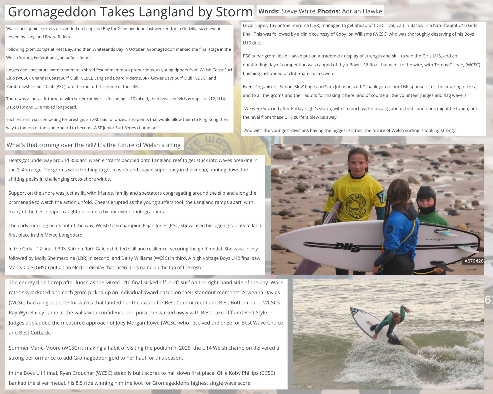

### DIY SOS, Good Vibes
**11 Nov 2020:** News feature covering the opening of Surfability UK’s purpose-built adaptive surf facility at Caswell Bay following a BBC DIY SOS Big Build project supported by Children in Need. The article highlights the work of Surfability founder Ben Clifford and the organisation’s mission to help surfers with physical and cognitive impairments to experience the freedom of riding waves. Exclusive comment from DIY SOS presenter, Nick Knowles.

Read on [Carve Magazine](https://www.carvemag.com/2020/11/diy-sos-good-vibes/)

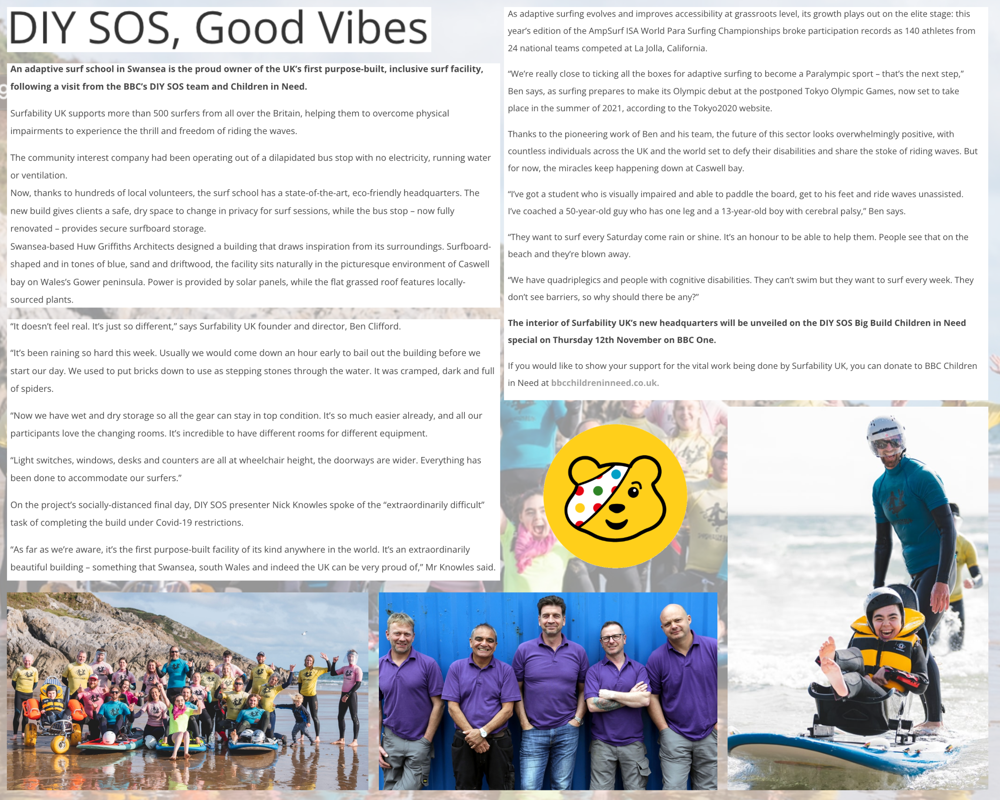

### Meet Swansea Super-Grom & British U18 Champ Patrick Langdon-Dark
**15 Dec 2017:** Snapshot of my interview with Welsh surfer Patrick Langdon-Dark following his rise through the UK junior ranks, including his U18 UK Pro Surf Tour title and success on the Nerf Clash of the Groms series. The conversation explores his training regime, early surfing influences on Gower, competitive ambitions and the challenge of balancing education with a developing international surf career.

Read in full on [Wavelength Magazine](https://wavelengthmag.com/interview-patrick-langdon-dark/)

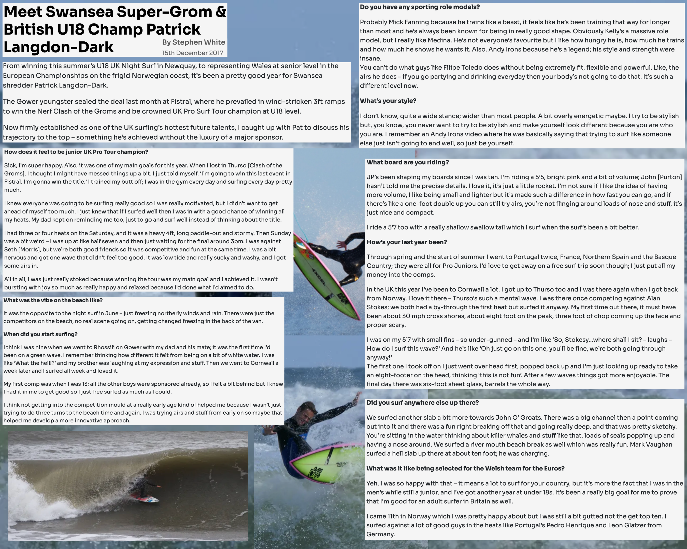

### From the Quest for Sponsorship to the Hunt for the World’s Biggest Waves
**23 Nov 2015:** Snapshot of my interview with British big-wave surfer Andrew Cotton following the release of his film *Behind The Lines*. The conversation explores the realities of chasing giant waves at Nazaré and Mullaghmore, the challenge of securing sponsorship and funding for big-wave projects, and the physical and mental demands of pushing the limits of modern big-wave surfing. 

Read in full on [The Inertia](https://www.theinertia.com/surf/from-the-quest-for-sponsorship-to-the-hunt-for-the-worlds-biggest-waves/
)

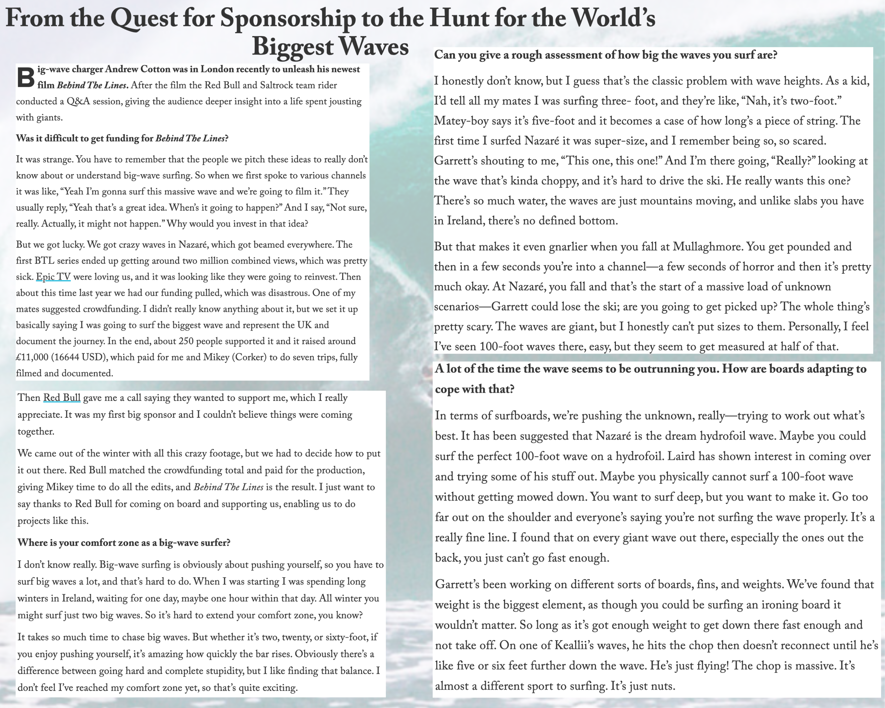

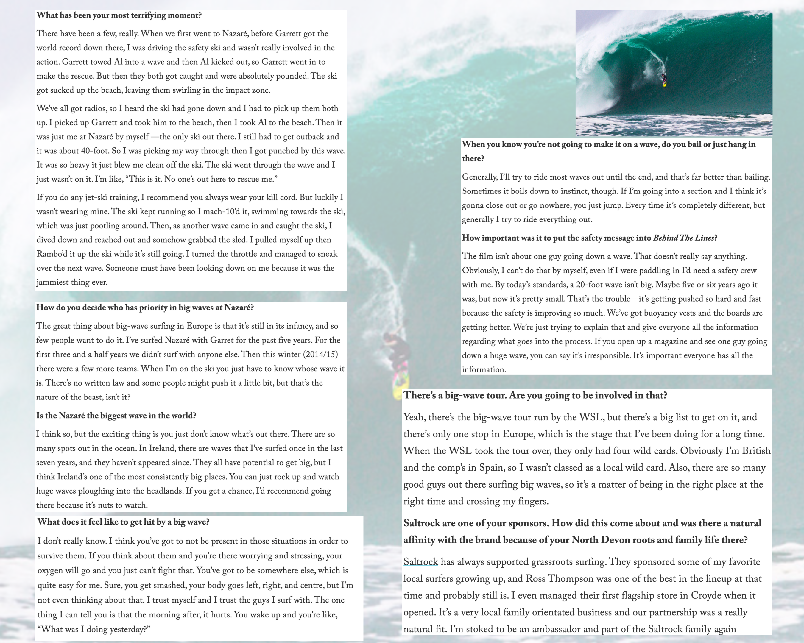
